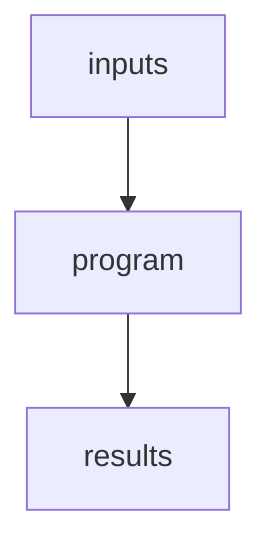
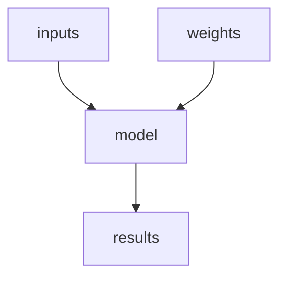
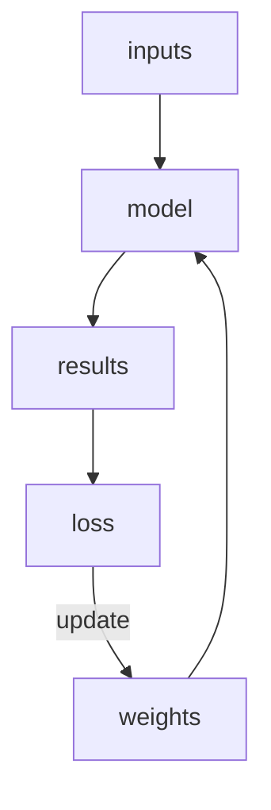

I'm going through the [Practical Deep Learning for Coders](http://course.fast.ai) course by Jeremy Howard. I’ll be sharing notes here on my site, all tagged with [fast.ai](https://daniel.feldroy.com/tags/fast.ai).

**This is my personal note-taking, not an article.** This won't be fancy prose like what makes up the majority of this site. If you want to see a big batch of notes in this style I took in the early part of my Python career, check out my [pydanny-event-notes](https://pydanny-event-notes.readthedocs.io/en/latest/). 

## Lesson 1: Getting started

[course.fast.ai/Lessons/lesson1.html](https://course.fast.ai/Lessons/lesson1.html)

## Deep learning has come a long way

What was impossible just a few years ago is cheap/easy now  

- Can sometimes be done on modern laptops with GPUs  
- Instead of days or weeks can take minutes or seconds  
- Doesn’t take a lot of code  

## Images are just a bunch of numbers.

In the lesson RGB images are:  

```python
# (height in pixes)
# (width in pixes)
# (3 is RGB)
height * width * 3 
```

So an image dimension might be:

```python
          # height   width    RGB
6220800 = 1920     * 1080   * 3
```

## Random Deep Learning notes

- You typically can’t search on "not a something"
- You don’t need particularly large images to do deep learning on them
- Datablocks are a tool for creating data learners. Data learners give fastai info it needs to create (or train?) a model  
- Computer vision models are easy to check because you can look at your results  

## Top down training  

How the instructor teaches, also [see my notes on lesson 0](https://daniel.feldroy.com/posts/course-fastai-lesson-00)

- We started by showing training of a model  
- People learn better with context in place  
- [Mathematician’s Lament](https://www.amazon.com/Mathematicians-Lament-School-Fascinating-Imaginative/dp/1934137170?taqg=mlinar-20) by Paul Lockhart  
- [Making Learning Whole](https://www.amazon.com/Making-Learning-Whole-Principles-Transform/dp/0470633719?tag=mlinar-20) by David Perkins  
- We learn best following the sport method  
    - We first learn a simplified version of the game  
    - We then learn the techniques over time, adding more skills and polish as time goes by  
- First learn how to build and deploy models before we learn how they work   

## About the instructor: [Jeremy Howard](https://en.wikipedia.org/wiki/Jeremy_Howard_(entrepreneur))

- [Deep Learning for Coders with fastai & PyTorch](https://www.amazon.com/Deep-Learning-Coders-fastai-PyTorch/dp/1492045527/?tag=mlinar-20), free version at [github.com/fastai/fastbook](http://github.com/fastai/fastbook)  
- Spent 30 years doing machine learning  
- Founded [Kaggle](https://kaggle.com), top ranked competitor on the platform
- First person to do ML for a company  
- His students have beaten Google and other bigtech teams in coding competitions  
- Google started using his methods in their models  
- Inventor of the ULMFiT algorithm, a critical component of the modern LLM   
- Prefers a functional style over class. So we will see a lot of `map` usage and other FP patterns. See [here](https://docs.fast.ai/dev/style.html) for details.
- Likes to do everything in Jupyter notebooks

## Why is Deep Learning faster/easier now?    

Why can we do a bird recognizer fast now, but couldn’t do it before  

- In 2015 a new way of doing came out that changed everything 
- Took a more layered approach
- Where they took patterns and trained the models to recognize said patterns
- They were able to recognize patterns in batches, then composite them
- This is possible to code these pattern recognizers by hand, but neural networks were able to recognize the patterns and assemble them more quickly

## Other Image Recognizer tricks

Image recognizers can be used on a lot of non-image things

- Recognize sound patterns
- Time series
- Computer mouse movements
- What about code?

## Myths about Deep learning

| Myth | Truth |
| -- | -- |
| Need lots of math | High school math is sufficient |
| Need lots of data | Seen record breaking results with 50 rows of data |
| Lots of expensive computers | We can get state-of-the-art for free/cheap |


Myth of expensive processes is sold by big companies who want to sell expensive products. 

## About pytorch

- pytorch took over from tensorflow
- Reason is that the technical fundamentals are better
- pytorch is a lower-level library, taking a lot of coding effort to do anything
- fastai is a wrapper around pytorch that makes pytorch more accessible


## What is Fastai?

Fastai is a Python library: [docs.fast.ai](https://docs.fast.ai/)

- is a wrapper around pytorch, makes pytorch a lot more accessible
- so instead of spending a lot of time in code, you are doing business. 
- Me: Your reqs should be complicated, not your code
- won a best paper award in 2020


## Class given in Jupyter notebook!

- Slides rendered in Jupyter
- Kaggle is where lesson notebooks can be found
- Jupyter serves as coding environment and calculator

## Datablocks - master them!

Intermediate type of system that creates data learners

```python
dataloaders = DataBlock(
    blocks=(ImageBlock, CategoryBlock), 
    get_items=get_image_files, 
    splitter=RandomSplitter(valid_pct=0.2, seed=42),
    get_y=parent_label,
    item_tfms=[Resize(192, method='squish')]
).dataloaders(path, bs=32)
```

- `blocks`: Deep learning community has found a small number of model types work great for most scenarios
    - `ImageBlock` - An image
    - `CategoryBlock` - Classify an item as one of something
- `get_items` - func for getting items
- `splitter` - sets aside data for validation
- `get_y` - Function for returning the parent folder of a path
- `items_tfms` - "item transforms" runs on every item evaluated and makes sure they end up same size. For example, all images are the same height and width

## DataLoaders

`DataLoaders` are what datablocks generate

- Runs slow unless in a GPU
- Runs in big batches on data that is all the same size
- Happens in batches, so `show_batch` has a specific meaning (Not sure yet what this means)

Continuing from the example above:

```python
dataloaders.show_batch(max_n=6)
```

## Models

- A few models are all that you need to do most of your work, resnet will probably suffice for most of what we'll do at least in beginning of course
- [timm](https://timm.fast.ai/) is the largest collection of CV models in the world
    - fastai integrates it
- Models are small and fast because someone has trained models and loaded them up to places like download.pytorch.org
- `fastai.fine_tune` is a function that it takes pre-trained weights to just teach the models diffs between our data and what the original data is.
    - Another description: "Fine-tuning" a model means that we're starting with a model someone else has trained using some other dataset (called the pretrained model), and adjusting the weights a little bit so that the model learns to recognise your particular dataset.
- To create Dataloaders (DLs) for segmentation, use X (follow-up to find what X is)

## Tabular Analysis

Tabular Analysis is for column-based data like spreadsheets and databases

- Must identify categorical columns
- Type dispatch figures out the right thing to do depending on the types of data
- Don't fine tune, instead fit a cycle of data (I hear this standard has changed, follow up to find out more)
- Q: What is a cycle?

## Collaborative filtering

Collaborative filtering is used to come up with recommendation systems

- Looking at how similar people like similar products
- Get some prefereces and come up with a list of what people like
- We'll find out later why: Go lower than the range and higher than the range

## Jupyter presentation tip

Note: Next time I give a technical talk I'm going to use Jupyter so I can have live code examples

- Use [rise](https://rise.readthedocs.io/) to make presentations using jupyter

## Regular programming vs Deep Learning

*Note: The code examples below will eventually render to flowcharts powered by [mermaid](https://mermaid.js.org/). For the moment they just display as plaintext.*

Normal code



Neural network (I'm not sure this is accurate)



What is a neural network?

1. Multiplies weights times inputs
2. Takes all the negative numbers and replaces them by zeros
3. Loss is how good the results are

Next step:



We need a way to update the weights depending on the size of the loss. The better we calculate the loss, the better everything will be.

This algorithm is infinitely flexible as a computable function. If this architecture flow of a neural network can be created, then with enough time and data anything can be done.

This is awesome: What fastai's `learn.predict()` function does is turn the neural network into something that uses a typical coding pattern of `inputs --> program --> results`

